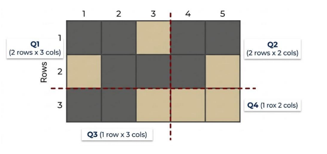
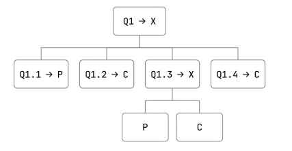

# Projeto 2 — Codificando Mapas

## Integrantes
- Isabella Rubio Venancio - RA10778364
- Matheus Alves de Miranda - RA10746221

## Disciplina
**Algoritmos e Programação II**  
Universidade Presbiteriana Mackenzie — Campus Alphaville

---

## Descrição

Este projeto implementa um sistema de **codificação recursiva de mapas**.

O mapa é composto por uma matriz onde cada célula pode conter:

- `#` → parede
- `.` → corredor

O programa converte esse mapa em um código compacto utilizando:

- `P` → submapa composto apenas por paredes
- `C` → submapa composto apenas por corredores
- `X` → submapa misto (necessita divisão recursiva)

---

## Funcionamento

O algoritmo verifica se o submapa é uniforme.

### Caso Base

Se todas as células forem iguais:

- imprime `P` se forem paredes
- imprime `C` se forem corredores

A recursão é encerrada.

---

### Caso Recursivo

Se houver mistura de `#` e `.`:

1. imprime `X`
2. divide o mapa em até 4 quadrantes
3. chama recursivamente a função `codificar()`

Ordem dos quadrantes:

- **Q1** → superior esquerdo
- **Q2** → superior direito
- **Q3** → inferior esquerdo
- **Q4** → inferior direito

---

## Estrutura do Código

### `main()`

Responsável por:

- leitura das dimensões
- inicialização da leitura do mapa
- chamada da codificação

---

### `lerMapa()`

Realiza a leitura recursiva do mapa.

**Parâmetros:**

- `i` → linha atual
- `j` → coluna atual
- `linhas` → total de linhas
- `colunas` → total de colunas

---

### `uniforme()`

Verifica recursivamente se todas as células possuem o mesmo valor.

**Retorno:**

- `1` → uniforme
- `0` → não uniforme

---

### `codificar()`

Função principal recursiva.

Responsável por:

- verificar uniformidade
- emitir `P`, `C` ou `X`
- dividir em quadrantes
- chamar a si mesma recursivamente

---

## Exemplo de Entrada

```txt
3
5
# # . # #
# . . # #
# # # . .
```

---

## Saída Esperada

```txt
Codigo: XXPCXPCCPPC
```
--




